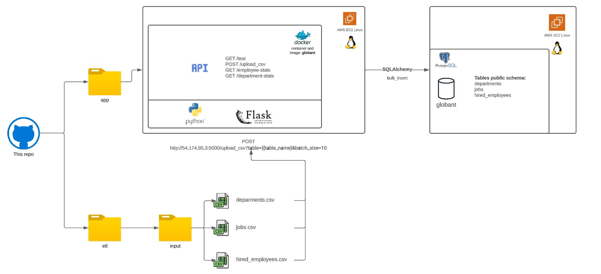

<!-- PROJECT LOGO -->
<br />
<div align="center">
  <a href="https://github.com/leonardoburbanov/de_coding_g_lburbano">
    
  </a>

<h3 align="center">Globant’s Data Engineering Coding
Challenge
</h3>

<a href="https://www.linkedin.com/in/leoburbano/">
    <p align="center">Leonardo Burbano</p>
  </a>

  <p align="center">
    Developed a REST API to receive historical data from CSV files and also answer a pair of SQL queries.
    <br />
</div>


<!-- TABLE OF CONTENTS -->
<details>
  <summary>Table of Contents</summary>
  <ol>
    <li>
      <a href="#about-the-project">About The Project</a>
      <ul>
        <li><a href="#built-with">Built With</a></li>
      </ul>
    </li>
    <li>
      <a href="#getting-started">Getting Started</a>
      <ul>
        <li><a href="#prerequisites-etl">Prerequisites ETL</a></li>
      </ul>
    </li>
    <li><a href="#usage">Usage</a></li>
    <li><a href="#test">Test</a></li>
    <li><a href="#license">License</a></li>
    <li><a href="#contact">Contact</a></li>
  </ol>
</details>


<!-- ABOUT THE PROJECT -->
## About The Project

Here is a diagram of the architecture implemented to solve the challenge:




As you can see, I created two main folders: **/app** and **/etl**. **/app** folder contains the API REST developed in Flask with integration to the PostgreSQL database. **/etl** contains the ETL created to be executed in any machine with Python 3.10.4+ and with all libraries in etl/requirements.txt installed.

**/app** is deployed in an AWS EC2 Linux virtual machine using docker.
**/etl** could be launched on demand, using python etl.py inside the folder.


<p align="right">(<a href="#about-the-project">back to top</a>)</p>


### Built With

* Python 3.10.4
* Windows 11 64b
* Docker 24.0.2
* Postman v10.15

<p align="right">(<a href="#about-the-project">back to top</a>)</p>


<!-- GETTING STARTED -->
## Getting Started

In a few words, you could test the API independently using the postman collection included in the root folder: **Globant_de.postman_collection.json**

The requests included are executing a call to the URL: http://54.174.85.3:5000
You could configure a prod environment with the variable: **globant_backend** with the endpoint URL. Additionally, you could run the ETL to execute a load of all files using API requests in Python.

You should put the .csv files in the folder **etl/input** maintaining the name convention: departments.csv, jobs.csv, hired_employees.csv. You also could configure the batch size in the etl.py file.

### Prerequisites ETL

1. The app.py should be running at http://54.174.85.3:5000.

2. Only to run the ETL you should install the requirements in **etl/requirements.txt**
* pip
  ```sh
  pip install -r requirements.txt
  ```
3. Is recommended to use a virtual machine in Python to avoid dependencies conflict:
* Python
  ```sh
  python -m venv dev
  cd dev/Scripts
  ./activate
  ```
3. And with the environment activated, you could install the requirements and run the ETL.

4. Please, before running the ETL the .csv files should be located in the folder: **etl/input/**


### Installation of app.py in AWS Linux virtual machine with Docker (Optional)

1. Install docker
  ```sh
  sudo yum install docker
  ```

More info: https://www.cyberciti.biz/faq/how-to-install-docker-on-amazon-linux-2/

2. Install git
  ```sh
    sudo yum update -y
    sudo yum install git -y
    git version
  ```

To configure a connection with a Github repo using SSH follow the steps in this tutorial: https://cloudaffaire.com/how-to-install-git-in-aws-ec2-instance/

3. Clone the repo
   ```sh
   git clone git@github.com:leonardoburbanov/de_coding_g_lburbano.git
   ```
4. Inside the repo, go to the app folder
   ```sh
   cd app
   ```
5. Launch the docker image and container 
   ```sh
    sudo service docker start
    docker build -t globant .
    docker run --name globant -d -p 5000:5000 globant -e DATABASE_URI=postgresql://<USER>:<PASSWORD>:5432/globant
   ```
6. Don't forget to allow connections to the EC2 by its security group at port 5000 (TCP). And get the public IP to test: http://public_ip:5000/test

7. Don't forget to review the Postgresql connection "DATABASE_URI" at the Dockerfile


### Deploy Postgresql in an AWS EC2 Linux (Optional)
Recommended tutorial: https://devopscube.com/install-configure-postgresql-amazon-linux/

In **app/queries/exploratory** you could find ddl configurations

<p align="right">(<a href="#about-the-project">back to top</a>)</p>


<!-- USAGE EXAMPLES -->
## Usage

Once you located the files in the **etl/input** folder you could run the ETL:
   ```sh
    cd etl
    python etl.py
   ```

And you could check the result in the console. And also the logs in **etl/logs**.
If the execution results in a successful upload of all the files, the files will be moved to **etl/input/processed** folder, if they are not successfully uploaded will be located in **etl/input/errors**

If you change the URL of the API server or you need to run at local, please adjust the **API_ENDPOINT** variable in the **etl/etl.py** file.

<p align="right">(<a href="#about-the-project">back to top</a>)</p>

<!-- TEST EXAMPLES -->
## Test

The test run automatically on docker file execution:
   ```sh
    cd app
    pytest api_test.py
   ```

And you could check the result in the console. And also the logs in **etl/logs**.
If the execution results in a successful upload of all the files, the files will be moved to **etl/input/processed** folder, if they are not successfully uploaded will be located in **etl/input/errors**

If you change the URL of the API server or you need to run at local, please adjust the **API_ENDPOINT** variable in the **etl/etl.py** file.

<p align="right">(<a href="#about-the-project">back to top</a>)</p>


<!-- LICENSE -->
## License

Distributed under the MIT License. See `LICENSE.txt` for more information.

<p align="right">(<a href="#about-the-project">back to top</a>)</p>

<!-- CONTACT -->
## Contact
Leonardo Burbano - [LinkedIn](https://www.linkedin.com/in/leoburbano/)
Project Link: [https://github.com/leonardoburbanov/de_coding_g_lburbano](https://github.com/leonardoburbanov/de_coding_g_lburbano)

<p align="right">(<a href="#about-the-project">back to top</a>)</p>